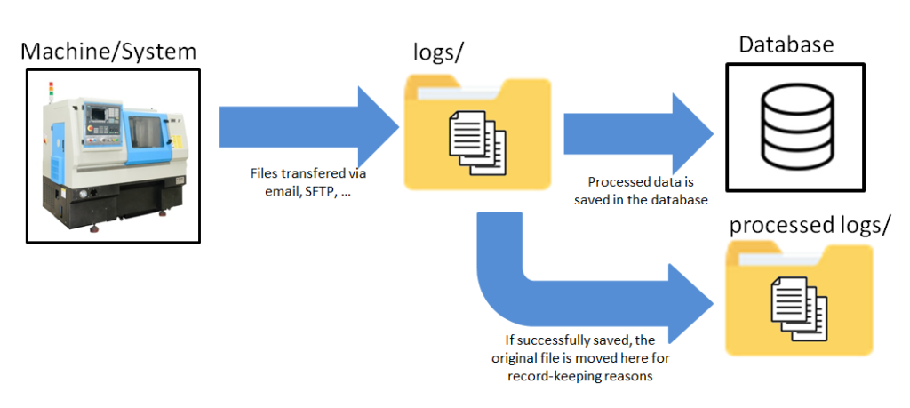
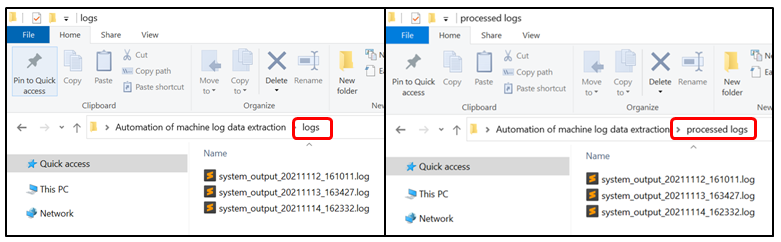
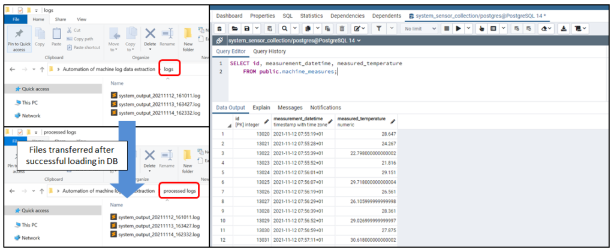

# Automation-of-machine-log-data-extraction

## 1. Introduction

It is quite common for people to have to extract data from documents (i.e: pdfs, logs, …), process/clean them and load them into a database or another type of document.

This project aims at **showing how a simple process can be set up in which the data is extracted** from the log files generated by a machine **and are processed and put into a database**. The general process is as follows:

   
  <i> General overview of the ETL process followed </i>

## 2. Environment

In our case the input files are stored in a folder called “logs” and if successfully loaded, they are moved to a folder named “processed logs”. The script resides in the parent directory of these two files. These folders and scripts can be placed anywhere as long as the reference to them are correctly updated, but for simplicity and managerial point of views it is a good idea to have them in this structure.

   
  <i> Display of the environment </i>

## 3. How the script works

The general steps of the script are as follows:

- Get the files present in a directory.
- For each document apply a ETL process:
	- Extract the file’s content (E).
	- Process the file (T).
	- Load the transformed data into a database (L).
	- If successful, move that file into another folder to mark it as processed.
- Return information about the status.

Note that the script doesn’t deal with the placement of the source files, as this is company specific (i.e: are the files received by email, generated by a system and placed somewhere, …?).

## 4. Results

As we can see in the following image, once the script runs, the file’s content is uploaded into a database and the processed files are moved to a new location for record-keeping reasons.

   
  <i> Results from running the script. Moved files (left). Database table content (right). </i>

## Disclaimer

There are already some tools (referred as “Data pipeline” tools) in the market which facilitate this process (i.e: Azure, AWS, …).

However, they require an upfront sign in (together with per use cost), which can be an overkill when you are not even sure if they have the right tool for it or if you are dealing with a small project.

On top of that, because they are constantly evolving platforms, it will require quite a technical person to facilitate, setup the environments before even you have started working.

Because of this, for small projects I recommend creating small automating processes such as this one, as they are easier to maintain, they don’t have dependencies and there is no cost of entry.
